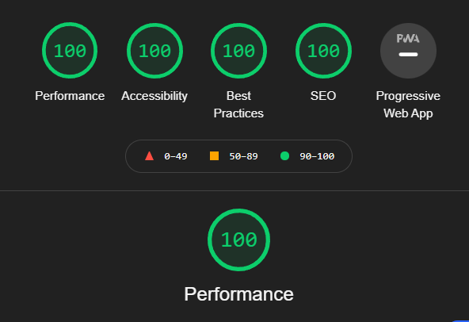
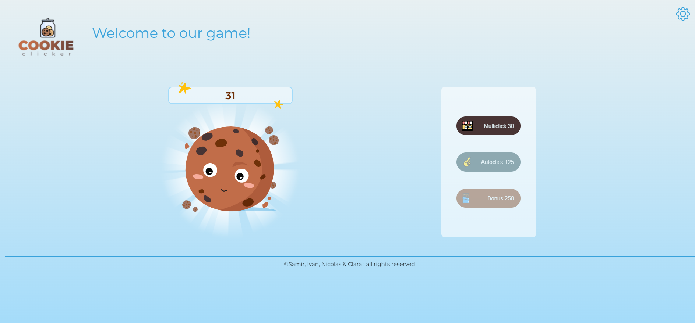
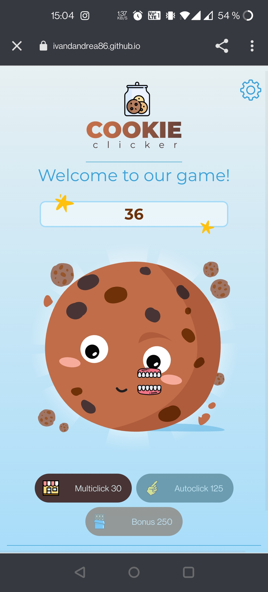

# Cookie-Clicker v1.00

## Instruction
---
Click on the big Cookie to earn more cookies.
Then buy upgrade to earn more and more cookies to unlock achievement.

## Development
---
The project was made with a progressive enhancement, content and mobile first approch.
We start to create a project structure and then we have identified all major components and features.
So the back-end team began to develop each feature individually and and the front-end team developed the graphie components and designed the UI.
at the end we merged the two phases and started the testing phase to find bugs and identify future implementations

## Features
---
- Multiplier

- Autoclicker

- Bonus

- Save & Load Buttons

- Bite Cursor animation

- SFX and Music (composed by Nicolas)

- Bonus sounds & animation (in progress)

## Team
---

- Front-end web development -> [Clara Climent](https://github.com/ClaraCliment)
- Project management & full stack dev -> [Ivan D'Andrea](https://github.com/IvanDandrea86)
- Back-end web development -> [Samir Nacer](https://github.com/nass22)
- Full stack dev -> [Nicolas Valiacas](https://github.com/NicolasValiacas)

## Final Result
---

Is not Iphone Responsive :'(

[Link Cookie Clicker](https://ivandandrea86.github.io/cookieClicker/)

